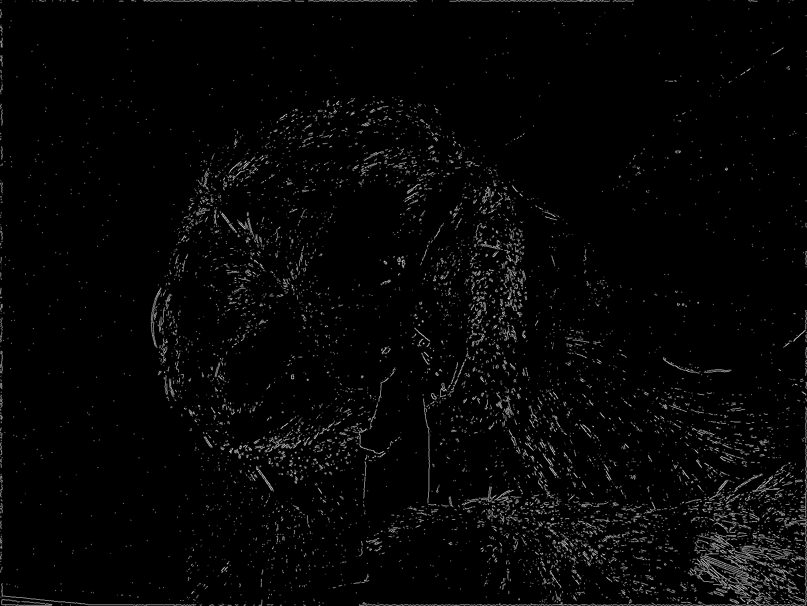

# Image edge detection using NVIDIA NPP with CUDA

## Overview

This project demonstrates the use of NVIDIA Performance Primitives (NPP) library with CUDA to perform edge detection.

example: 


converts to:




## Code Organization

```inputs/```
This folder contains any number of jpg, png, pgm grayscale images to be processed.

```outputs/```
Converted files will be written here.

```src/```
Project source code.

```README.md```
This file.

## Key Concepts

Performance Strategies, Image Processing, NPP Library

## Supported SM Architectures

[SM 3.5 ](https://developer.nvidia.com/cuda-gpus)  [SM 3.7 ](https://developer.nvidia.com/cuda-gpus)  [SM 5.0 ](https://developer.nvidia.com/cuda-gpus)  [SM 5.2 ](https://developer.nvidia.com/cuda-gpus)  [SM 6.0 ](https://developer.nvidia.com/cuda-gpus)  [SM 6.1 ](https://developer.nvidia.com/cuda-gpus)  [SM 7.0 ](https://developer.nvidia.com/cuda-gpus)  [SM 7.2 ](https://developer.nvidia.com/cuda-gpus)  [SM 7.5 ](https://developer.nvidia.com/cuda-gpus)  [SM 8.0 ](https://developer.nvidia.com/cuda-gpus)  [SM 8.6 ](https://developer.nvidia.com/cuda-gpus)

## Supported OSes

Linux

## Supported CPU Architecture

x86_64

## CUDA APIs involved
[NPP image filtering](https://docs.nvidia.com/cuda/npp/image_filtering_functions.html)

## Dependencies needed to build/run
[FreeImage](../../README.md#freeimage), [NPP](../../README.md#npp), [cuda-samples](https://github.com/NVIDIA/cuda-samples)

## Prerequisites

Download and install the [CUDA Toolkit 11.4](https://developer.nvidia.com/cuda-downloads) for your corresponding platform.
Make sure the dependencies mentioned in [Dependencies]() section above are installed.

## Build and Run

### Linux
Project source includes files from Nvidia samples 'Common' & 'Common/UtilNPP': ensure a copy is placed in build directory.
See: [https://github.com/NVIDIA/cuda-samples]

```
$ make clean build
```

include debug symbols (see: cuda-gdb)
```
$ dbg=1 make
```

## Running the Program
After building the project, you can run the program using the following command:

```bash
./edgeDetector
```
This command will execute the compiled binary, scanning the 'inputs' directory for images, executing an edge detection NPP kernel on each, and writing results to 'outputs'.

optional args:
```bash
--input=altinputdir
--output=altoutputdir
```
